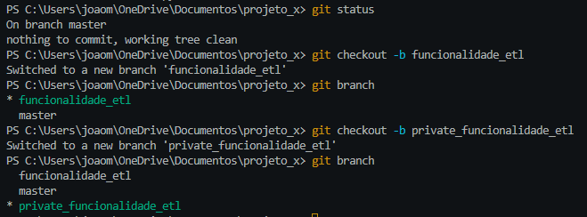
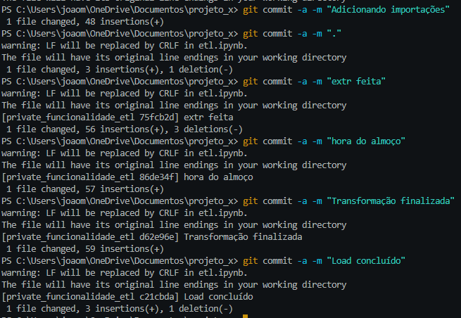
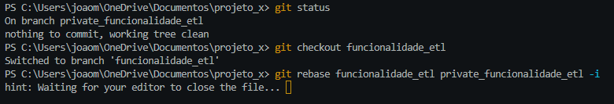
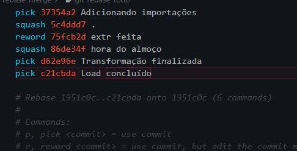
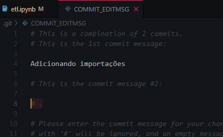
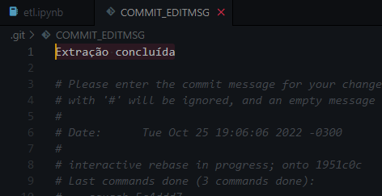
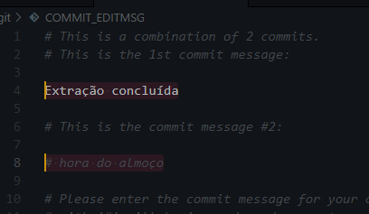
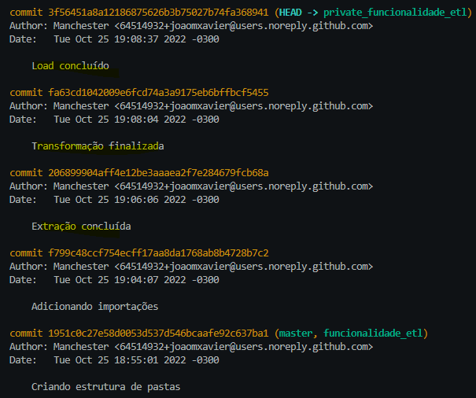
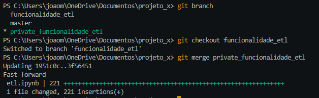

# Melhorando os commits do projeto

## A importância do commit

* `O problema:` commits sem sentido atrapalham o projeto
* Os commits precisam ser `padronizados` e `semânticos`. Isso vai fazer com que o projeto cresça de forma saudável
* Bons commits ajudam em:
    * Review de `pull request` 
    * Melhoria dos log em `git log`
    * Manutenção do projeto (voltar e avançar código) 

## Técnica de private branch

* Técnica para resolver branches com commits ruins: `private branches` 
* São branches privadas que `não serão compartilhadas no repositório`, ou seja, podemos colocar qualquer commit (+ liberdade nos commits)
* Ao fim da solução do problema, fazemos um `rebase`
    * `git rebase <branch_atual> <private_branch> -i` (o -i é de iterativo)
* Escolhemos os branches para excluir (`squash`) e renomear (`reword`)
* Etapas
    1. Criar a branch da nova funcionalidade que iremos desenvolver (geralmente criamos a partir da main): `git checkout -b funcionalidade_a`
    2. Criar a branch privada a partir da branch nova: `git checkout -b private_funcionalidade_a`
        * Nesta branch privada podemos fazer o commit que quisermos. Vamos usar ela para trabalhar

        
        

    3. Supondo que terminamos a nova funcionalidade, então voltamos para a branch da funcionalidade: `git checkout funcionalidade_a`
    4. E fazemos o rebase com o comando `git rebase funcionalidade_a private_funcionalidade_a -i`

        

    5. Apertar "i" para editar o arquivo (terminal) `OU` da para editar no VS code
        * Na parte superior teremos os commits que foram feitos na branch privada
        * Para manter o commit usamos `pick`
        * Para excluir o commit usamos `squash`
        * Para manter e renomear o commit usamos `reword`
        
    6. Usar a tecla "ESC" para sair da edição (terminal) `OU` se estiver no VS code: salvar arquivo e fechar
    7. Escrever ":x!" e "Enter" para salvar o arquivo (terminal)
    8. Vai aparecer os commits que foram feitos
        * Para editar o commit podemos usar a tecla "i"
        * Para parar de editar e salvar usamos "ESC" e depois ":x!"
        * Se quisermos remover a mensagem de algum commit, podemos colocar um "#" na frente
        * Os commits que escolhemos para renomear precisamos apertar editar e colocar o nome que queremos
         → Comentando a mensagem do commit que dei squash
         → Renomeando o commit
         → Comentando a mensagem do commit que dei squash
    9. Por fim podemos dar um "clean" para limpar o terminal e depois "git log" para visualizar o resultado final
         → git log para visualizar os commits
    10. Enviar tudo para a branch da funcionalidade
         → Jogando para a branch da funcionalidade
    11. Se estiver tudo certo, podemos jogar na branch main