# Criação de Repositório

* Ao inicializarmos um repositório, precisamos preencher uma série de informações (nome do repo, descrição, licença, ...). Essas informações são importantes e podem ser alteradas ao longo do projeto. Quanto melhor definido for o projeto, mais fácil das pessoas encontrarem

* Adicionar o arquivo 'README' com a descrição completa (como a pessoa faz para rodar o projeto, o que ela precisa baixar antes, configurações necessárias, ...)

# Aba Issue

* Podemos criar tarefas ou notificar possíveis bugs do projeto
* `Importante` para a organização se manter ciente do que ainda `precisa fazer ou corrigir`
* A issue deve ter uma label e também um responsável
* Podemos criar novas labels
* Quando a issue é criada, ela fica como `open` até ser resolvida. No momento em que ela é marcada como `closed` sinaliza que está resolvida
* Muito importante quando estamos trabalhando em equipe

Criando a issue:

Descrição e rótulo da issue, e adicionando responsável:

Ao apertar na Issue, temos mais informações sobre ela (o progresso da issue). Neste local colaborativo pode-se conversar sobre a nova funcionalidade/bug:

# Aba Pull Request

* É o local onde os colaboradores do projeto enviam código para resolver as `issues` ou `adicionar novas` funcionalidades
* A ideia é que o código `não seja inserido direto na master` e sim passe por um pull request, `para ser analisado` (evitar bagunça)
* O pull request vem um de `novo branch` criado no projeto e enviado para o repo, com o incremento de código
* O desenvolvedor apenas cria o Pull Request, mas quem finaliza o PR é o Tech Lead

1. Desenvolver a issue ou nova funcionalidade através de uma branch e fazer push dessa branch.

2. Depois de fazer push da branch, o desenvolvedor vai na aba "Pull Request" e aperta no botão "New Pull Request"

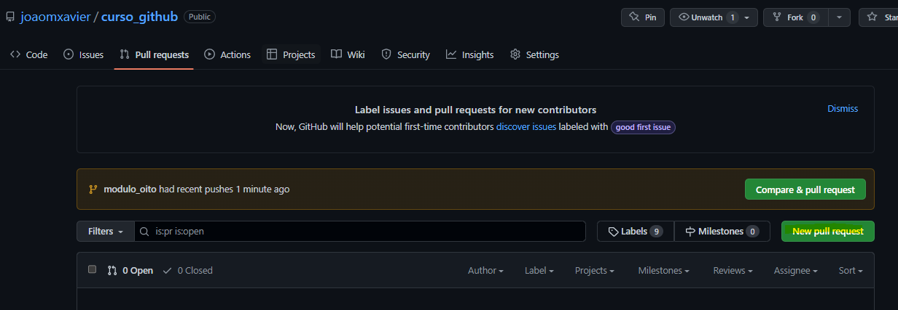

3. Selecionar a branch base e a branch compare. Geralmente a branch base é a master (receberá as alterações) e a branch compare é a que contém as issues/novas funcionalidades. Depois basta apertar em "Create Pull Request"

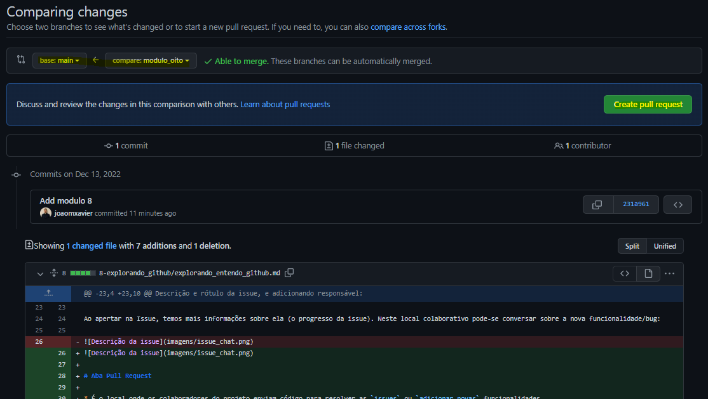

4. Adicionando comentários e descrição do Pull Request

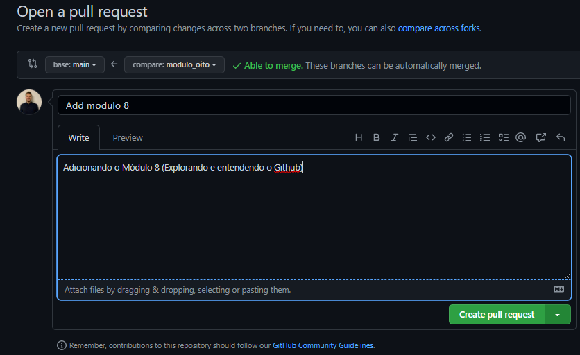

5. Visualizando o Pull Request criado na aba "Pull Request"

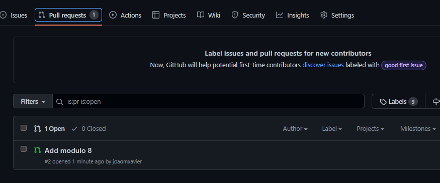

6. Dentro do Pull Request Enviado, temos a aba "Files Changed" para verificar todas as mudanças feitas

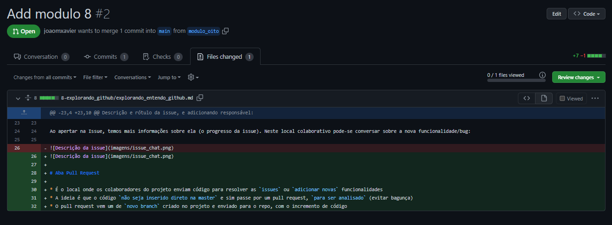

7. Dentro do Pull Request Enviado, temos a aba "Files Changed" para verificar todas as mudanças feitas

8. Se estiver tudo certo, o Tech Lead pode realizar o Merge do Pull Request através do botão "Merge Pull Request"

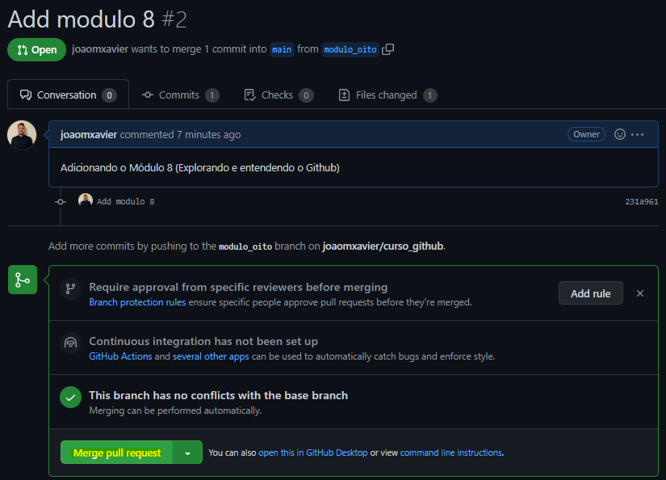

Mostrando que o Pull Request deu certo (merge aconteceu)

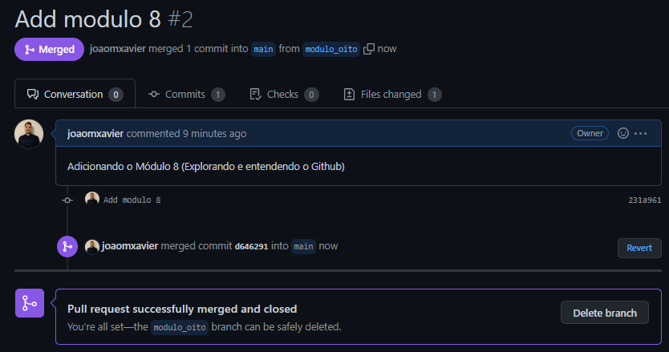

Depois de finalizado, o Pull Request fica em "Closed"

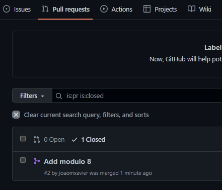

# Aba Projetos

* Podemos criar um projeto e utilizar um quadro `kanban` para ajudar na organização do time, criando notas que podem virar `issues`

# Aba Wiki

* É o local onde podemos criar uma documentação mais extensa para o projeto. Como: descrever funcionalidades, bugs conhecidos e não solucionados, regras de negócios, entre outras funções

* A ideia é que seja um `repositório de conhecimento` sobre o projeto. Centralizar a ideia do projeto na Wiki

* É possível criar páginas para deixar a documentação ainda mais organizada

# Aba Insights

* Temos informações detalhadas do projeto, como: quem são os contribuidores, commits, forks e muito mais

* Interessante para entender como o projeto está andando e a sua `evolução desde o início`

# Aba Settings

* Temos acesso a diversas configurações do projeto

* É onde podemos alterar o nome do repositório ou remover/adicionar features. Alterar para público/privado

* E também é nela que `adicionamos colaboradores` ao projeto

* O repositório pode ser `removido` nessa aba

# Criando Gists

* Gist são pequenos blocos de código que podem ser hospedados no GitHub. É basicamente um "mini repositório" criado rapidamente e que pode ser compartilhado com outros devs. 

* O gist é um código simples, objetivo e que resolve alguma problema específico.

* Pode ser usado, por exemplo, para armazenar uma solução que achou interessante para algum problema e não quer perder. 

* O link do Gist `pode ser compartilhado`

* No fim das contas o Gist `acaba sendo um repositório` também

Local para criar a Gist

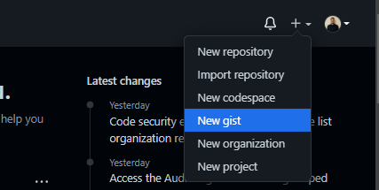

Basta escrever a solução e publicar. Pode ser um gist publico ou privado.

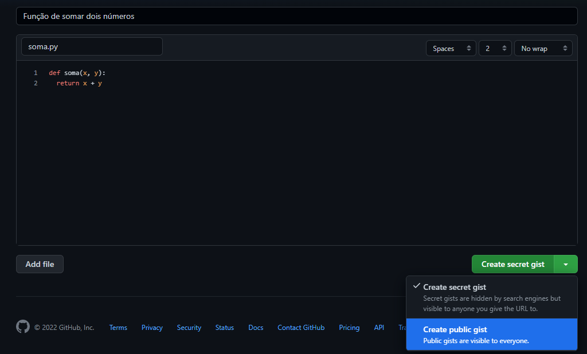

A Gist pode ser acessada por outros devs (se for pública, ele pode acessar com o link da Gist). Eles também podem fazer comentários, clonar, editar, ...

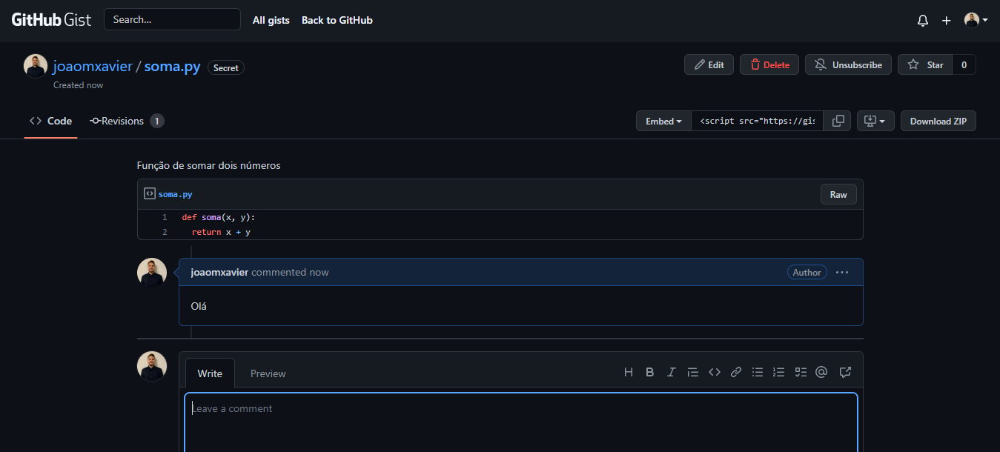
