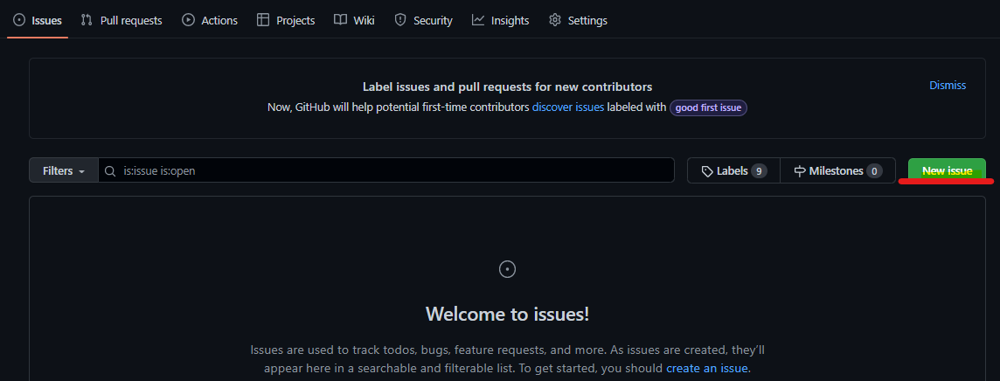
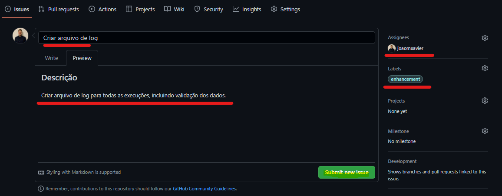
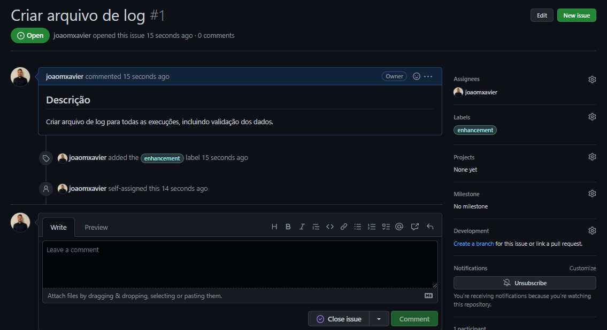

# Criação de Repositório

* Ao inicializarmos um repositório, precisamos preencher uma série de informações (nome do repo, descrição, licença, ...). Essas informações são importantes e podem ser alteradas ao longo do projeto. Quanto melhor definido for o projeto, mais fácil das pessoas encontrarem

* Adicionar o arquivo 'README' com a descrição completa (como a pessoa faz para rodar o projeto, o que ela precisa baixar antes, configurações necessárias, ...)

# Aba Issue

* Podemos criar tarefas ou notificar possíveis bugs do projeto
* `Importante` para a organização se manter ciente do que ainda `precisa fazer ou corrigir`
* A issue deve ter uma label e também um responsável
* Podemos criar novas labels
* Quando a issue é criada, ela fica como `open` até ser resolvida. No momento em que ela é marcada como `closed` sinaliza que está resolvida
* Muito importante quando estamos trabalhando em equipe

Criando a issue:

Descrição e rótulo da issue, e adicionando responsável:

Ao apertar na Issue, temos mais informações sobre ela (o progresso da issue). Neste local colaborativo pode-se conversar sobre a nova funcionalidade/bug:

